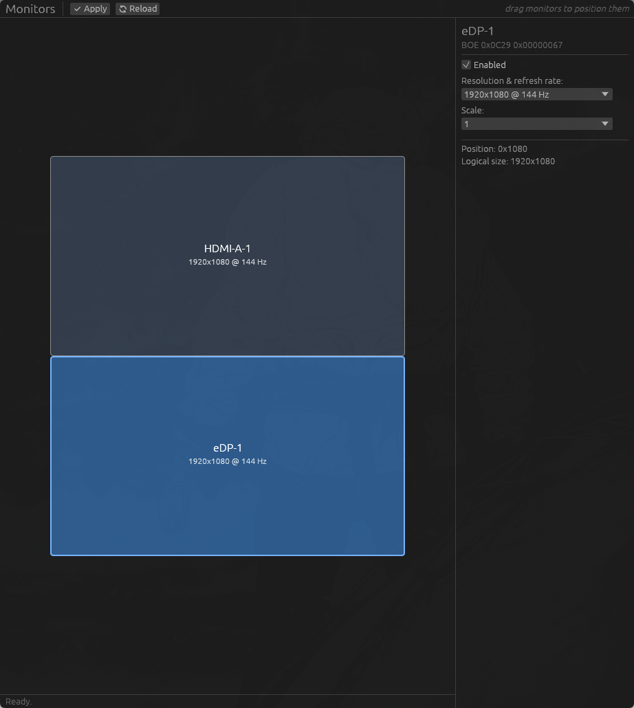

# hyprland-monitors

[](https://github.com/ImFelipeOliveira/hyprland-monitors/actions/workflows/ci.yml)
[](https://github.com/ImFelipeOliveira/hyprland-monitors/releases)
[](LICENSE)
[](https://www.rust-lang.org)

A drag-and-drop monitor configuration GUI for **[Hyprland](https://hypr.land)**.
Arrange monitors on a canvas with automatic edge snapping, change resolution,
refresh rate and scale, enable/disable outputs — then apply live with an
auto-revert safety net and persist to your config file. No hand-editing, no
coordinate math, no way to lock yourself out of your screens.



## Table of contents

- [Features](#features)
- [Supported setups](#supported-setups)
- [Installation](#installation)
- [Usage](#usage)
- [Safety model](#safety-model)
- [Troubleshooting](#troubleshooting)
- [FAQ](#faq)
- [Architecture](#architecture)
- [Development](#development)
- [Contributing](#contributing)
- [Roadmap](#roadmap)
- [Acknowledgments](#acknowledgments)
- [License](#license)

## Features

- **Drag-and-drop canvas** — monitors are proportional rectangles; drag them
  above, below, left or right of each other. Edges snap to neighbors while you
  drag; overlaps are resolved automatically on drop; the layout is normalized to
  a `0x0` origin the way Hyprland expects.
- **Per-monitor settings** — resolution + refresh rate (from the modes the
  monitor actually advertises), scale, and enable/disable. Disabling your last
  enabled monitor is refused.
- **Atomic live apply** — the whole layout is applied to the running session in
  a single compositor request, so there is never a transient overlapping state.
- **Confirm-or-revert countdown** — after applying you get 15 seconds to
  confirm. No confirmation (e.g. all screens became unusable) → everything
  reverts automatically.
- **Safe persistence** — confirmed layouts are written to your config file with
  a rolling `.bak` backup and an atomic write, preserving your comments, env
  lines, `monitorv2` blocks and any generic fallback rule.
- **Hotplug aware** — plugging/unplugging a monitor refreshes the canvas within
  seconds via Hyprland's event socket.
- **Both config providers** — works with Lua-configured Hyprland (e.g.
  [Omarchy](https://omarchy.org)) *and* the classic `.conf` style, detected
  automatically.

## Supported setups

The config provider is detected at startup via `hyprctl systeminfo`:

| Provider | Detected via | Live apply | Persists to |
|---|---|---|---|
| **Lua** (e.g. Omarchy) | `configProvider: lua` | `hyprctl eval 'hl.monitor({...})'` | `~/.config/hypr/monitors.lua` |
| **Classic** (.conf) | anything else | `hyprctl --batch "keyword monitor ...; ..."` | `~/.config/hypr/monitors.conf` |

On classic setups, make sure your `hyprland.conf` sources the monitors file:

```ini
source = ~/.config/hypr/monitors.conf
```

Status: the **Lua path is validated end-to-end on real hardware** (Omarchy,
dual-monitor laptop). The classic path mirrors it and is unit-tested, but has
not yet been reported against a real classic setup — [reports welcome](https://github.com/ImFelipeOliveira/hyprland-monitors/issues/new/choose)!

## Installation

### Prebuilt binary (recommended)

Grab the latest tarball from the [releases page](https://github.com/ImFelipeOliveira/hyprland-monitors/releases):

```sh
tar xzf hyprland-monitors-*-x86_64-unknown-linux-gnu.tar.gz
cd hyprland-monitors-*/
install -Dm755 hyprland-monitors ~/.local/bin/hyprland-monitors
install -Dm644 hyprland-monitors.desktop ~/.local/share/applications/hyprland-monitors.desktop
# adjust the Exec= path in the .desktop file if needed
```

### With cargo

```sh
cargo install --git https://github.com/ImFelipeOliveira/hyprland-monitors
```

### From source

```sh
git clone https://github.com/ImFelipeOliveira/hyprland-monitors
cd hyprland-monitors
cargo install --path .
mkdir -p ~/.local/share/applications
cp assets/hyprland-monitors.desktop ~/.local/share/applications/
```

**Requirements:** a running Hyprland session with `hyprctl` on PATH. Outside
Hyprland the app shows a clear error and exits.

## Usage

1. Launch `hyprland-monitors` (or find **Hyprland Monitors** in your app
   launcher).
2. **Drag** a monitor rectangle to reposition it — it snaps to the edges of its
   neighbors. Click a monitor to select it and edit resolution, refresh rate,
   scale or enabled state in the side panel.
3. Click **Apply**. The layout takes effect immediately in your session.
4. A dialog counts down 15 seconds:
   - **Keep & save** — the layout is confirmed and written to your config file
     (so it survives reboots);
   - **Revert now** — or just wait for the countdown — restores the previous
     layout.
5. **Reload** discards unapplied edits and re-reads the current compositor
   state at any time.

## Safety model

Reconfiguring monitors is the one settings change that can lock you out of your
own machine. The design treats that as the primary requirement:

- Apply is **atomic**: one request for the whole layout. Applying monitors one
  at a time creates a moment where two monitors overlap, which Hyprland rejects
  ("Your monitor layout is set up incorrectly").
- Apply never writes to disk. Persistence only happens after you explicitly
  confirm within the countdown; an unusable layout reverts by itself.
- Before every config write, the previous file is copied to `monitors.lua.bak` /
  `monitors.conf.bak`, and the write itself is atomic
  (temp file + rename) — a crash mid-write can't corrupt your config.
- Only the `hl.monitor(...)` / `monitor = ...` lines managed by the app are
  rewritten. Comments, `hl.env(...)`, `monitorv2` blocks and the generic
  fallback rule pass through untouched.
- If you never touch a monitor's mode, its existing mode string (e.g.
  `preferred`) is kept rather than pinned to a fixed resolution.

## Troubleshooting

**"keyword can't work with non-legacy parsers. Use eval."** — you're on a
Lua-configured Hyprland and something (an old version of this app, or another
tool) used `hyprctl keyword`. Current versions detect the provider and use
`hyprctl eval` automatically. Update to the latest release.

**"Your monitor layout is set up incorrectly. Monitor X overlaps..."** — this
is Hyprland rejecting an overlapping layout. Current versions apply atomically
and shouldn't trigger it; if you see it, please open a bug report with the
status-bar message.

**Changes apply but don't survive a reboot (classic setups)** — check that your
`hyprland.conf` contains `source = ~/.config/hypr/monitors.conf`.

**"Could not connect to Hyprland"** — the app must run inside a Hyprland
session (`HYPRLAND_INSTANCE_SIGNATURE` must be set and `hyprctl` on PATH).

**A layout went wrong and I confirmed it anyway** — your previous config is in
`~/.config/hypr/monitors.lua.bak` (or `.conf.bak`); copy it back and reload
Hyprland.

## FAQ

**How is this different from nwg-displays / erans' hyprmon?**
[nwg-displays](https://github.com/nwg-piotr/nwg-displays) (GUI) and
[hyprmon](https://github.com/erans/hyprmon) (TUI) are great tools, but they
write the classic `monitors.conf` format only. hyprland-monitors additionally
speaks Hyprland's Lua config natively — the format Omarchy uses — including
applying live changes through `hyprctl eval`, and auto-detects which style your
system runs.

**Does it support rotation, mirroring, VRR, HDR?**
Not yet — see the [roadmap](#roadmap).

**Does it run as a daemon / auto-switch profiles when I dock?**
No. It's an on-demand configuration UI. For event-driven profile switching look
at kanshi-style tools (e.g. hyprdynamicmonitors).

**Why Rust + egui?**
Single static binary, no runtime dependencies beyond `hyprctl`, and an
immediate-mode canvas that made the drag-and-drop editor small and testable.

## Architecture

Light ports & adapters: abstractions exist only at the two real IO boundaries,
where they make the critical flow testable without a live compositor. The
directory tree mirrors the layers:

```
src/
├── main.rs                # wiring: provider detection → adapters → session → UI
├── domain/                # pure logic — no IO, no UI
│   ├── monitor.rs         #   Mode, MonitorState, RawMonitor, wire-format rendering
│   └── geometry.rs        #   Rect, edge snapping, overlap resolution, normalization
├── application/           # use cases, depends only on ports
│   ├── ports.rs           #   traits: Compositor, ConfigStore
│   └── session.rs         #   apply → confirm → keep/revert → persist state machine
├── adapters/              # real implementations of the ports
│   ├── hyprctl.rs         #   provider detection, EvalCompositor (Lua),
│   │                      #   KeywordCompositor (classic), event socket listener
│   ├── omarchy_lua.rs     #   monitors.lua store (Lua provider)
│   ├── hyprland_conf.rs   #   monitors.conf store (classic provider)
│   └── managed_lines.rs   #   shared line-rewrite core: managed block replacement,
│                          #   backup, atomic write
└── ui/                    # thin egui view, no business logic
    ├── mod.rs             #   App state + frame loop + adapter selection
    ├── canvas.rs          #   drag-and-drop canvas
    ├── panels.rs          #   toolbar, settings panel, status bar
    └── dialogs.rs         #   confirm countdown, fatal-error screen
```

Dependency direction: `ui → application → domain`, with `adapters` implementing
the `application` ports. Positions are computed in logical pixels
(resolution ÷ scale) and normalized so the enabled bounding box starts at 0x0.

Behavior is documented as living specs in [`openspec/specs/`](openspec/specs/)
(five capabilities: monitor detection, layout editor, live apply, config
persistence, config-style detection), managed with
[OpenSpec](https://github.com/Fission-AI/OpenSpec).

## Development

```sh
cargo test                                   # 36 tests, no compositor needed
cargo clippy --all-targets -- -D warnings    # CI-enforced, zero warnings
cargo fmt --all                              # CI-enforced formatting
cargo run                                    # needs a live Hyprland session
```

The apply/confirm/revert/persist state machine is fully covered with in-memory
fakes of both ports — auto-revert on timeout, atomic batch application, revert
on compositor rejection (naming the failing monitor), config round-trips for
both file formats, and persistence of disabled monitors.

### Release automation

- CI (fmt + clippy + tests + release build) runs on every push and PR.
- [release-please](https://github.com/googleapis/release-please) maintains a
  release PR from [Conventional Commits](https://www.conventionalcommits.org);
  merging it bumps the version, updates the CHANGELOG, tags and publishes a
  GitHub release.
- The release workflow attaches a prebuilt `x86_64-unknown-linux-gnu` tarball
  (+ sha256) to every release.
- Dependabot keeps Cargo dependencies and GitHub Actions up to date weekly;
  patch/minor bumps auto-merge once CI passes.

## Contributing

Contributions are very welcome — especially real-hardware reports from
**classic (.conf) setups**. Please read [CONTRIBUTING.md](CONTRIBUTING.md)
(dev setup, spec-driven workflow, commit conventions) and pick a template when
[opening an issue](https://github.com/ImFelipeOliveira/hyprland-monitors/issues/new/choose).
This project follows the [Contributor Covenant](CODE_OF_CONDUCT.md); security
issues go through [private reporting](SECURITY.md).

## Roadmap

Planned as future OpenSpec changes, roughly in order:

- [ ] Rotation / transform support
- [ ] Monitor mirroring
- [ ] VRR toggle
- [ ] Validation on a real classic (.conf) Hyprland setup
- [ ] Monitor profiles (save/load named layouts)
- [ ] AUR package

## Acknowledgments

- [Hyprland](https://hypr.land) — and its excellent `hyprctl` IPC.
- [Omarchy](https://omarchy.org) — whose Lua-based config motivated this tool.
- [egui / eframe](https://github.com/emilk/egui) — the immediate-mode GUI this
  is built on.
- [nwg-displays](https://github.com/nwg-piotr/nwg-displays) and
  [erans/hyprmon](https://github.com/erans/hyprmon) — prior art for monitor
  layout editors on wlroots/Hyprland.

## License

[MIT](LICENSE) © 2026 Felipe Oliveira
